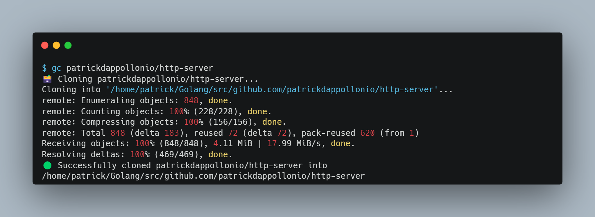

# `gc-rust` a GitHub clone helper

[](https://github.com/patrickdappollonio/gc-rust/releases)

- [`gc-rust` a GitHub clone helper](#gc-rust-a-github-clone-helper)
    - [Installation](#installation)
    - [Usage](#usage)
    - [Defining a location for the repositories](#defining-a-location-for-the-repositories)
    - [Specifying a branch](#specifying-a-branch)

`gc-rust` is a tiny Rust application that allows you to clone GitHub repositories with ease to a predetermined location.

As a Go developer, I liked the idea that my code was organized using a `$GOPATH`, in the form of:

```bash
$HOME/go/src/github.com/<username>/<repository>
```

So I kept maintaining even non-Go projects in the same way.



This is where `gc-rust` comes in handy: Given a GitHub repository URL, it will perform the `git clone` operation by finding the appropriate location for the resulting folder.

For example, given the repository:

```bash
github.com/example/application
```

It will correctly create the folder structure so the repository is cloned to:

```bash
$HOME/go/src/github.com/example/application
```

You can configure the location where the repositories are cloned by setting the `$GC_DOWNLOAD_PATH` environment variable. [Instructions below](#defining-a-location-for-the-repositories).

If there was a preexistent folder in the location where the clone should happen, it will ask you if you want to overwrite it. **This will destroy any prior content in the destination folder!**

### Installation

Download a copy of the binary and place it anywhere in your `$PATH`. Downloads are available in the [releases page](https://www.github.com/patrickdappollonio/gc-rust/releases/latest).

If you have Homebrew installed on macOS or Linux, you can also install it via:

```bash
brew install patrickdappollonio/tap/gc-rust
```

### Usage

To clone a GitHub repository, you can use any of the following instructions:

```bash
gc-rust git@github.com:example/application.git
gc-rust github.com/example/application
gc-rust example/application
gc-rust https://github.com/example/application
gc-rust https://github.com/example/application/issues
gc-rust https://github.com/example/application/security/dependabot
gc-rust https://github.com/example/application/this/is/a/made/up/path
```

All of them will detect the repository as `github.com/example/application` and clone it to the correct location.

The output of `gc-rust` will all be printed to `stderr` with one exception: the folder location where it was cloned. This is useful if you want to create a function that both clones a repository and then `cd` into it:

```bash
function gc() {
  if ! type "gc-rust" > /dev/null; then
    echo -e "Install gc-rust first from github.com/patrickdappollonio/gc-rust"
    exit 1
  fi

  cd "$(gc-rust "$@")" || return
}
```

With this in your `.bashrc` or `.bash_profile`, you can now simply run `gc` and it will clone the repository and `cd` into it:

```bash
$ pwd
/home/patrick/go/src/github.com/patrickdappollonio/gc-rust

$ gc https://github.com/patrickdappollonio/http-server
 Cloning patrickdappollonio/http-server...
Cloning into '/home/patrick/Golang/src/github.com/patrickdappollonio/http-server'...
remote: Enumerating objects: 848, done.
remote: Counting objects: 100% (228/228), done.
remote: Compressing objects: 100% (156/156), done.
remote: Total 848 (delta 183), reused 72 (delta 72), pack-reused 620 (from 1)
Receiving objects: 100% (848/848), 4.11 MiB | 17.99 MiB/s, done.
Resolving deltas: 100% (469/469), done.
 Successfully cloned patrickdappollonio/http-server into /home/patrick/Golang/src/github.com/patrickdappollonio/http-server

$ pwd
/home/patrick/go/src/github.com/patrickdappollonio/http-server
```

### Defining a location for the repositories

By default, **`gc-rust` will clone the repositories to the path defined in the environment variable `$GC_DOWNLOAD_PATH`**. If this variable is not set, it will use the `$GOPATH` environment variable since the original idea came from Go project management. If neither are defined you'll see an error.

### Specifying a branch

Contrary to what you might think, **`gc-rust` will not deduce a branch name from the URL**. Instead, it will clone using whatever branch is currently set as the default in the repository. If you want to clone a specific branch, you can do so by specifying the `-b` or `--branch` flag:

```bash
# this will clone `patrickdappollonio/http-server` into the `feature-branch` branch,
# and not the branch called `example` (as seen by the URL)
gc-rust https://github.com/patrickdappollonio/http-server/tree/example -b feature-branch
```
